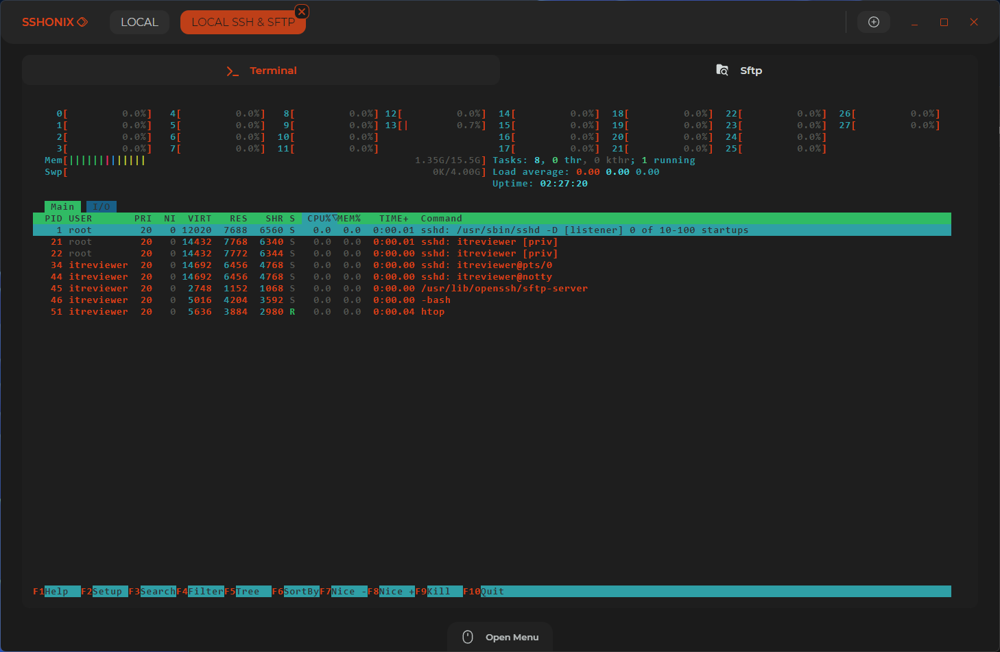
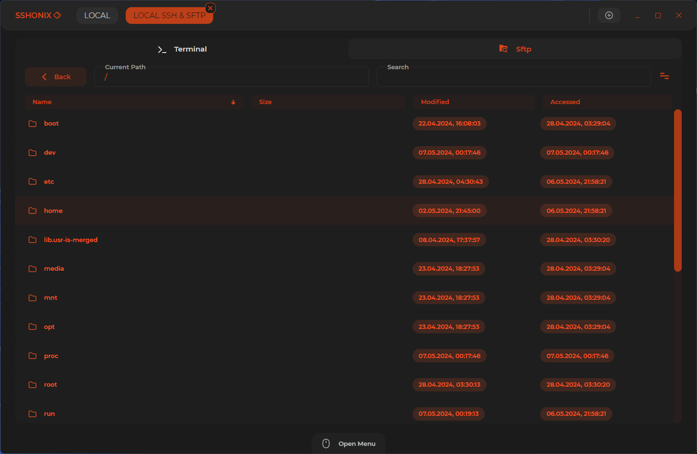
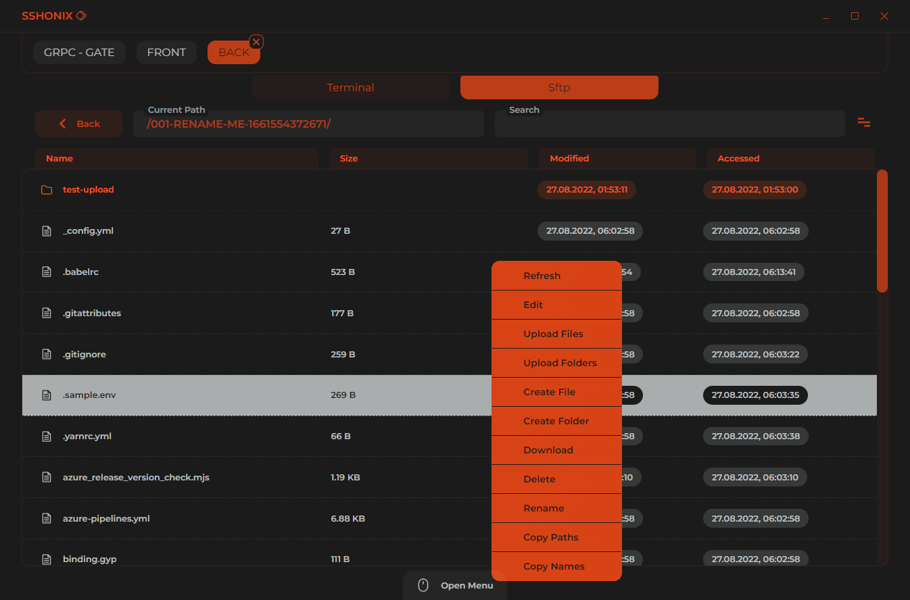

  

 

  
  

# Features

-   Also works as Standalone **SFTP** or **SSH** client.
-   Fast navigation between tabs
-   Update notifications.

## sFTP

-   Fast downloading / uploading (with no browsing lags)
-   Support of most file manipulation hotkeys

-   **Events**
    -   `REFRESH`
    -   `QICK EDIT` - Max file size is 10 mb
    -   `UPLOAD`
    -   `DOWNLOAD`
    -   `CREATE FILE`
    -   `CREATE FOLDER`
    -   `CUT`
    -   `COPY`
    -   `PASTE`
    -   `DELETE`
    -   `RENAME`
    -   `COPY PATHS` - Copy full absolute paths of files/folders to clipboard
    -   `COPY NAMES` - Copy names of files/folders to clipboard
-   **Transfers** - Displays **Active Transfers**, **Done Transfers** and **Transfers Errors**
-   **Search** - Regex (via js **RegExp**) search by **File**/**Folder** name in the current list

# Hotkeys

-   **Sftp - File List**

    -   `F2` - Rename
    -   `DEL` - Remove selected items
    -   `CTRL + R`, `F5` - Refresh items
    -   `CTRL + A` - Select all items
    -   `CTRL + C` - Copy items
    -   `CTRL + X` - Cut items
    -   `CTRL + V` - Paste items
    -   `ESCAPE` - Deselect all items
    -   `SHIFT + CLICK` - Range items select
    -   `CTRL + CLICK` - Multiple select by one

-   **Sftp - Quick File Edit**
    -   `ESCAPE` - Exit editing
    -   `CTRL + S` - Save and upload
-   **Main**
    -   `CTRL + Mouse Center Click` - Open/Hide menu

# You should know

**WINDOWS ONLY!**  
 
If you noticed abnormal behavior or other bug - please, create an issue.

### SFTP

-   **File uploading will rewrite an existing files.**

 
 
 
 
 

# Other Screens (v0.1.1)

  
  
  
