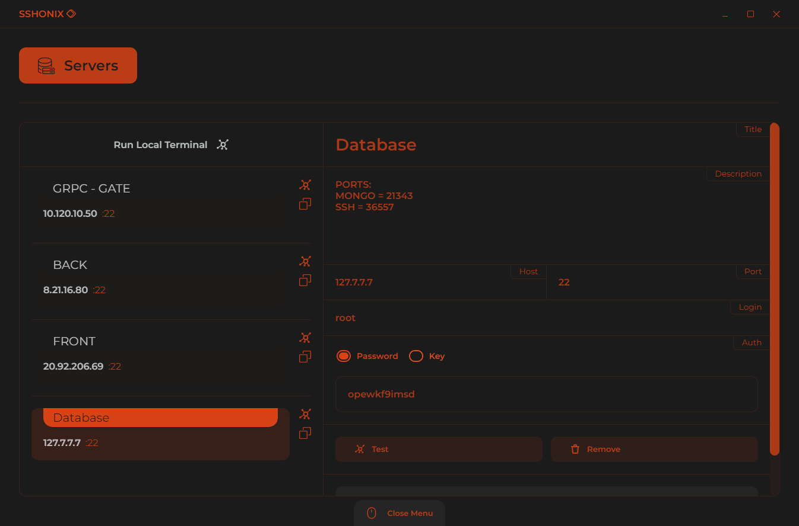
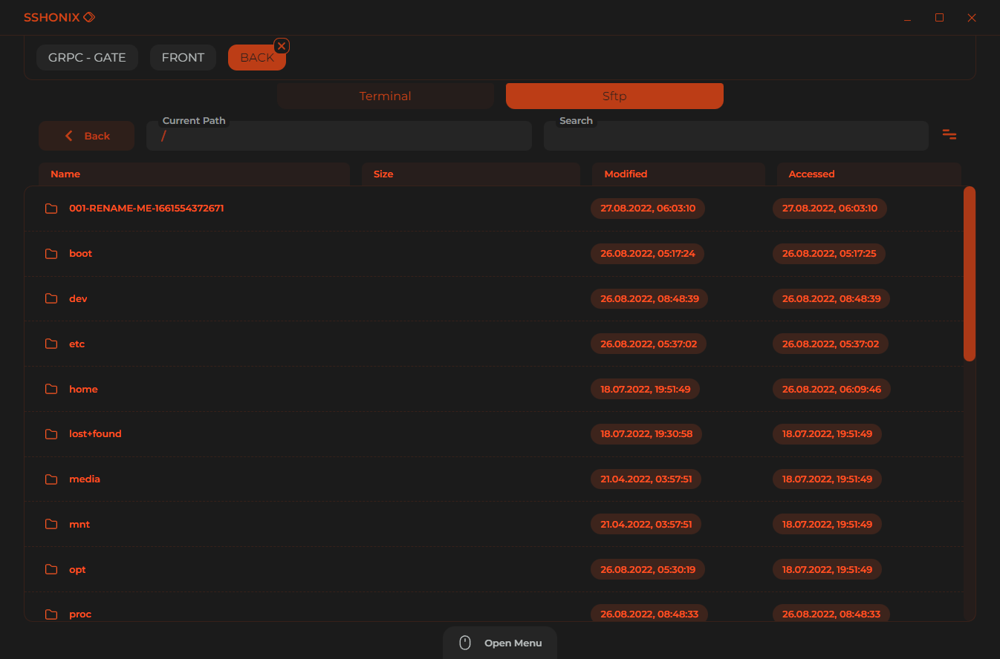
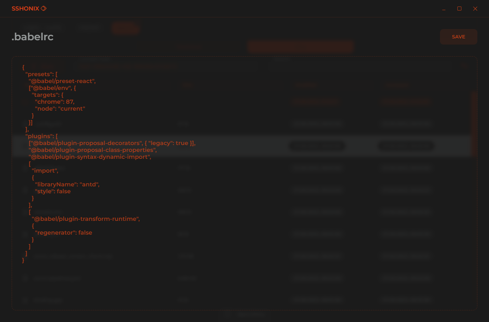

  

 

  
  
  

## WINDOWS ONLY!

# Features

-   **Terminal**
-   **Sftp Events**

    -   `REFRESH`
    -   `QICK EDIT` - Max size is 10 mb
    -   `UPLOAD FILES`
    -   `UPLOAD FOLDERS`
    -   `DOWNLOAD FILES`
    -   `DOWNLOAD FOLDERS`
    -   `CREATE FILE`
    -   `CREATE FOLDER`
    -   `DELETE`
    -   `RENAME`
    -   `COPY PATHS` - Full absolute paths
    -   `COPY NAMES` - Only file names

-   **Hotkeys**

    -   **Sftp**
        -   `F2` - Rename
        -   `CTRL + R`, `F5` - Refresh items
        -   `CTRL + A` - Select all items
        -   `ESCAPE` - Deselect all items
        -   `SHIFT + CLICK` - Range items select
        -   `CTRL + CLICK` - Multiple select by one
    -   **Main**
        -   `CTRL + Mouse Center Click` - Open/Hide menu

-   **Sftp Search** - Regex search in current directory
-   **Updates** - Update notifications.

# Other Screens

  
  
